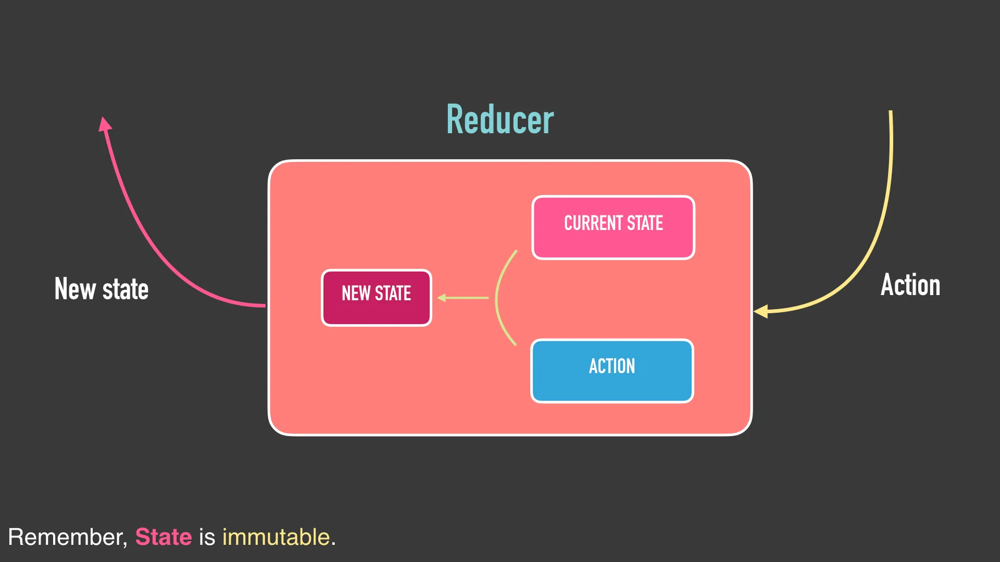
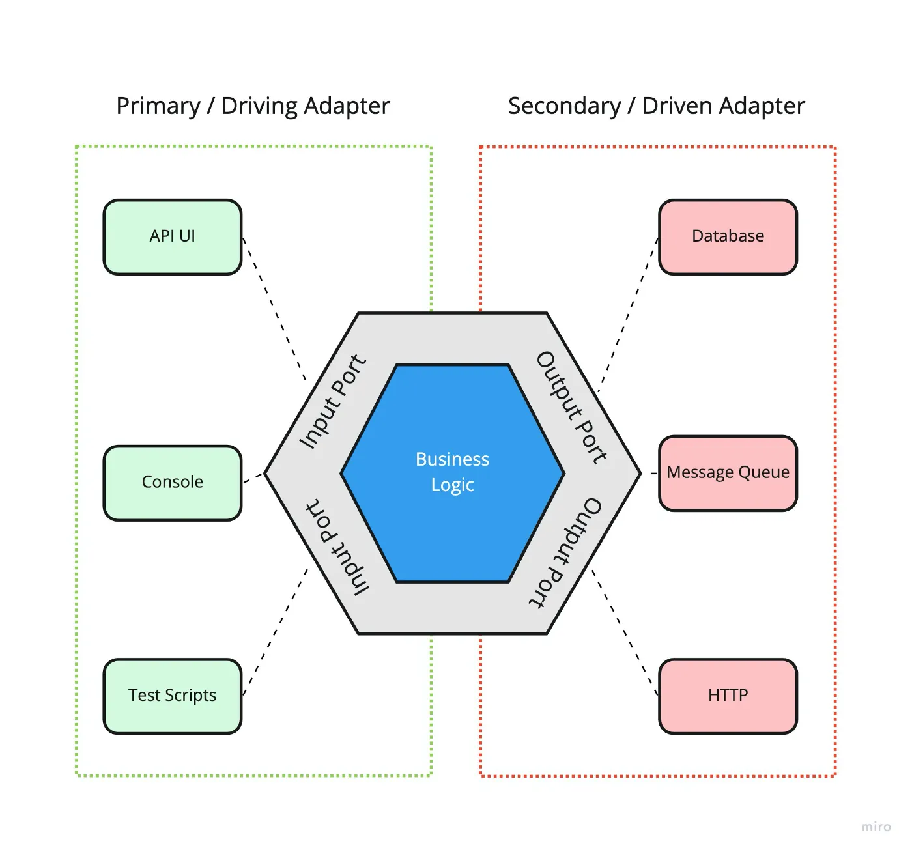

This is a Kotlin Multiplatform project targeting Android, iOS.

* `/composeApp` is for code that will be shared across your Compose Multiplatform applications.
  It contains several subfolders:
  - `commonMain` is for code that’s common for all targets.
  - Other folders are for Kotlin code that will be compiled for only the platform indicated in the folder name.
    For example, if you want to use Apple’s CoreCrypto for the iOS part of your Kotlin app,
    `iosMain` would be the right folder for such calls.

* `/iosApp` contains iOS applications. Even if you’re sharing your UI with Compose Multiplatform, 
  you need this entry point for your iOS app. This is also where you should add SwiftUI code for your project.

Learn more about [Kotlin Multiplatform](https://www.jetbrains.com/help/kotlin-multiplatform-dev/get-started.html)…

# Arquitecturas
## Unidirectional Data Flow

La Arquitectura de Flujo de Datos Unidireccional (UDF, por sus siglas en inglés) es un patrón donde el estado de la UI fluye en una sola dirección:

El usuario genera eventos (acciones).
El ViewModel o Presenter procesa la acción y actualiza el estado.
La UI se suscribe a los cambios de estado y se redibuja automáticamente.
Este patrón es común en MVI (Model-View-Intent), Redux, y Jetpack Compose.

## Arquitectura Hexagonal

La arquitectura hexagonal, también conocida como Arquitectura de Puertos y Adaptadores, es un patrón de diseño que busca aislar el núcleo de la aplicación (lógica de negocio) de las dependencias externas (como bases de datos, APIs, interfaces de usuario, etc.) mediante el uso de puertos y adaptadores.

### 1. **Núcleo (Core) o Dominio**
Es el corazón de la aplicación, donde reside la **lógica de negocio**. Aquí se definen las **entidades**, los **casos de uso** y las **reglas de negocio**.
- **Casos de uso (Use Cases)**: Representan las acciones principales de la aplicación (ejemplo: obtener usuarios, procesar pagos).
- **Entidades (Models)**: Definen los objetos de negocio (ejemplo: Usuario, Producto).

### 2. **Puertos**
Los puertos son **interfaces** que definen cómo interactuar con el núcleo de la aplicación. Existen dos tipos:
- **Puertos de entrada**: Permiten que el mundo exterior (interfaces de usuario, controladores) invoque los casos de uso del dominio.
- **Puertos de salida**: Permiten que el dominio interactúe con sistemas externos (bases de datos, servicios externos, APIs).

### 3. **Adaptadores**
Los adaptadores son responsables de la **comunicación entre los puertos y el mundo exterior**. Son implementaciones concretas que transforman los datos y las interacciones de una forma entendible para el núcleo de la aplicación.
- **Adaptadores de entrada**: Se encargan de recibir las solicitudes externas (ejemplo: controladores HTTP, interfaces de usuario).
- **Adaptadores de salida**: Se encargan de interactuar con las tecnologías externas (bases de datos, servicios web, almacenamiento).

### 4. **Capas**
La arquitectura está dividida en capas donde:
- El **núcleo de la aplicación** es completamente independiente y no conoce nada de los adaptadores ni de los puertos.
- Los **adaptadores** se colocan alrededor del núcleo, permitiendo que el sistema interactúe con el exterior sin acoplarse directamente a él.
